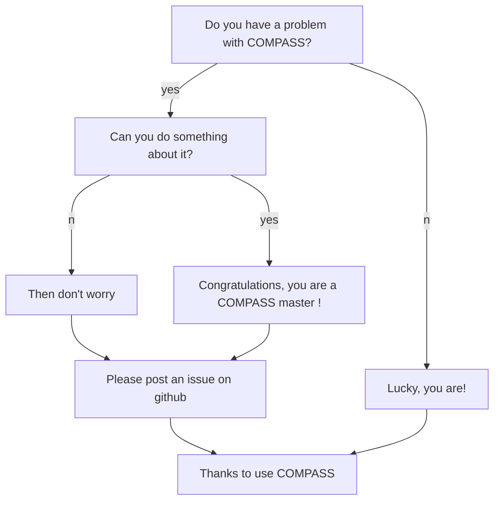

```mermaid
graph TB;
    A[Do you have a problem with COMPASS?]
    B[Then don't worry]
    C[Can you do something about it?]
    D[Congratulations, you are a COMPASS master !]
    E[Please post an issue on github]
    F[Lucky, you are!]
    G[Thanks to use COMPASS]
    A--no-->F;
    A--yes-->C;
    C--no-->B;
    C--yes-->D;
    B-->E
    D-->E
    E-->G
    F-->G
```

<!-- {: align="center" height="auto" width="410px"} -->
