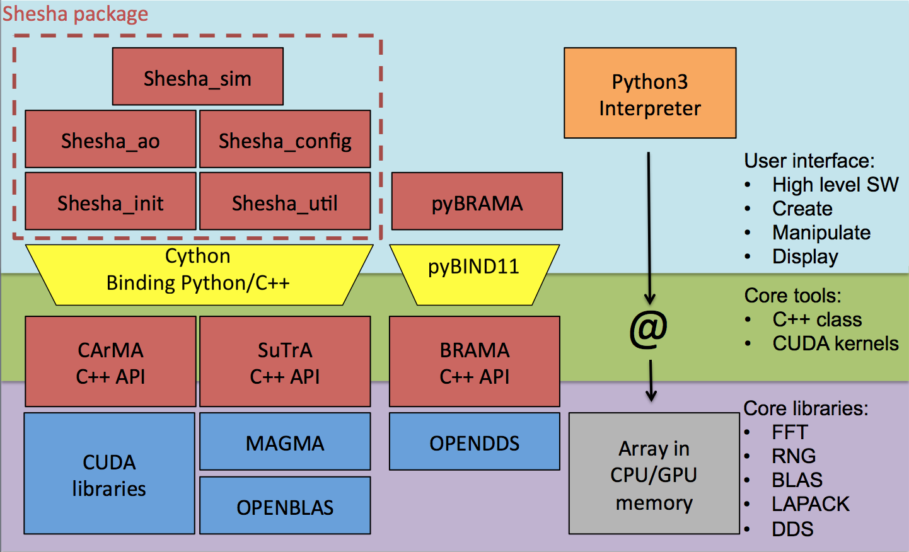

# User manual
This is the user manual for COMPASS. We will try to be as exhaustive as possible, but if you don't get the answer you are looking for, [contact us on the GitHub project](https://github.com/anr-compass/shesha).

* blabla
{:toc}

## 1. Quick start

### 1. Basic simulation
To launch a basic simulation with COMPASS, you can use our script with a parameter file as an argument :
```bash
cd $SHESHA_ROOT
ipython -i test/closed_loop.py path_to_your_parfile/parfile.py
```
Some basic parameter files are provided in the directory ```$SHESHA_ROOT/data/par/par4bench``` and an example is provided [here](#parameter-file)

After an initialization phase, the script will prompt in the terminal the short exposure Strehl ratio, the long exposure one, an estimation time remaining and the mean framerate of the simulation :
```bash
----------------------------------------------------
| iter# | S.E. SR | L.E. SR | ETR (s) | Framerate (Hz) |
| ----- |
100 	 0.748 	  0.748	     1.3 	 683.2
200 	 0.733 	  0.740	     1.2 	 683.9
300 	 0.742 	  0.741	     1.0 	 683.9
400 	 0.724 	  0.737	     0.9 	 684.1
500 	 0.740 	  0.737	     0.7 	 684.1
600 	 0.789 	  0.746	     0.6 	 684.3
700 	 0.710 	  0.741	     0.4 	 684.3
800 	 0.743 	  0.741	     0.3 	 684.2
900 	 0.696 	  0.736	     0.1 	 684.2
1000 	 0.709 	  0.733	     0.0 	 684.2
 loop execution time: 1.4643762111663818   ( 1000 iterations),  0.0014643762111663818 (mean)   682.8846251220482 Hz
```

### 2. Parameter file
For COMPASS,  a parameter file is a python file where the parameter classes are instantiated and setted to be imported by the simulation script. All the parameter classes are described in details [here](#parameter-classes). 
To write your own paramater file, remember those important points :
- Starts by importing the ```shesha_config``` module: it contains all the parameter classes
- Instantiates the paramater classes you need for your simulation. **Note that some of those classes are required to perform a simulation : Param_loop, Param_geom, Param_tel and Param_atmos.**
- Set the classes parameters using the setter functions. Those functions are usually named as ```set_<parameter name>```. 

An example of parameter file follows and others can be found in ```$SHESHA_ROOT/data/par/par4bench``` directory
```python
import shesha_config as conf

simul_name = "scao_sh_40m_80_8pix"

# loop
p_loop = conf.Param_loop()

p_loop.set_niter(5000)
p_loop.set_ittime(0.002)  

# geom
p_geom = conf.Param_geom()

p_geom.set_zenithangle(0.)

# tel
p_tel = conf.Param_tel()

p_tel.set_diam(40.0)
p_tel.set_cobs(0.12)

# atmos
p_atmos = conf.Param_atmos()

p_atmos.set_r0(0.16)
p_atmos.set_nscreens(1)
p_atmos.set_frac([1.0])
p_atmos.set_alt([0.0])
p_atmos.set_windspeed([20.0])
p_atmos.set_winddir([45])
p_atmos.set_L0([1.e5])

# target
p_target = conf.Param_target()

p_target.set_ntargets(1)
p_target.set_xpos([0])
p_target.set_ypos([0.])
p_target.set_Lambda([1.65])
p_target.set_mag([10])

# wfs
p_wfs0 = conf.Param_wfs()
p_wfs1 = conf.Param_wfs()
p_wfss = [p_wfs0]

p_wfs0.set_type("sh")
p_wfs0.set_nxsub(80)
p_wfs0.set_npix(8)
p_wfs0.set_pixsize(0.3)
p_wfs0.set_fracsub(0.8)
p_wfs0.set_xpos(0.)
p_wfs0.set_ypos(0.)
p_wfs0.set_Lambda(0.5)
p_wfs0.set_gsmag(3.)
p_wfs0.set_optthroughput(0.5)
p_wfs0.set_zerop(1.e11)
p_wfs0.set_noise(-1)
p_wfs0.set_atmos_seen(1)

# dm
p_dm0 = conf.Param_dm()
p_dm1 = conf.Param_dm()
p_dms = [p_dm0, p_dm1]
p_dm0.set_type("pzt")
nact = p_wfs0.nxsub + 1
p_dm0.set_nact(nact)
p_dm0.set_alt(0.)
p_dm0.set_thresh(0.3)
p_dm0.set_coupling(0.2)
p_dm0.set_unitpervolt(0.01)
p_dm0.set_push4imat(100.)

p_dm1.set_type("tt")
p_dm1.set_alt(0.)
p_dm1.set_unitpervolt(0.0005)
p_dm1.set_push4imat(10.)

# centroiders
p_centroider0 = conf.Param_centroider()
p_centroiders = [p_centroider0]

p_centroider0.set_nwfs(0)
p_centroider0.set_type("cog")

# controllers
p_controller0 = conf.Param_controller()
p_controllers = [p_controller0]

p_controller0.set_type("ls")
p_controller0.set_nwfs([0])
p_controller0.set_ndm([0, 1])
p_controller0.set_maxcond(1500)
p_controller0.set_delay(1)
p_controller0.set_gain(0.4)
```

###  3. Script
Thanks to the architecture of COMPASS, writing a script is easy. 

Let's take a look at our ```closed_loop.py``` script :
```python
import shesha_sim
from docopt import docopt
arguments = docopt(__doc__)
param_file = arguments["<parameters_filename>"]
sim = shesha_sim.Simulator(param_file)
sim.init_sim()
sim.loop(sim.config.p_loop.niter)
```
Let's go step-by-step :
- The first line imports the ```shesha_sim``` module: it contains the Simulator class used to perform the simulation. This class is described properly [here](#simulator-class).
- The next lines : 
```python
from docopt import docopt
arguments = docopt(__doc__)
param_file = arguments["<parameters_filename>"]
```
are used to get the parameter file name. ```docopt``` module is a command line arguments parser for python that can also set proper usage pattern and options for your script. For more information, visit [docopt.org](http://docopt.org/)
- ```sim = shesha_sim.Simulator(param_file)``` instantiates the Simulator class and loads the parameters define in the parameter file
- ```sim.init_sim()``` initializes the simulation.
- ```sim.loop(sim.config.p_loop.niter)``` runs the simulation for ```niter``` iterations

### 4. Interactions
If you had launched your script with python or ipython in interaction mode (```-i``` option), you will have access to the prompt after the iterations loop. At this point, you can interact with your simulation to display images (PSF, command matrix...) or to access at any internal quantity for debug. You can also modify your simulation and launch new iterations.

Remember that your Simulator instance ```sim``` has created objects and you can access to them:
- ```sim.config``` contains all the simulation parameters imported from your parameter file
- ```sim.tel``` is the telescope object
- ```sim.atm``` is the atmosphere object
- ```sim.wfs``` is the wavefront sensor object. It could contain several WFS depending on your parameter file
- ```sim.tar``` is the target object
- ```sim.dms``` is the DM object. It could contain several DM depending on your parameter file
- ```sim.rtc``` is the RTC object. It contains the centroiders and the controller that you have defined in the parameter file

All those objects have getter and setter methods which you can use to get information on what is going on your simulation or to set new parameters.

Some of the most useful methods are listed below:

| Method                         | Description                                                                 |
| :----------------------------- | :-------------------------------------------------------------------------- |
| **sim.tar.get_image(0,b"le")** | Return the long exposure PSF. Use ```b"se"``` to get the short exposure one |
| **sim.tar.get_phase(0)**       | Return the residual phase                                                   |
| **sim.wfs.get_binimg(0)**      | Return the SH WFS spots image                                               |
| **sim.wfs.get_pyrimg(0)**      | Return the pyramid WFS image                                                |
| **sim.dms.get_dm(b"pzt",0)**   | Return the DM shape                                                         |
| **sim.rtc.get_centroids(0)**   | Return the lastest centroids (X measurements first, then Y)                 |
| **sim.rtc.get_com(0)**         | Return the lastest DM commands                                              |
| **sim.rtc.get_imat(0)**        | Return the interaction matrix                                               |
| **sim.rtc.get_cmat(0)**        | Return the command matrix                                                   |

You can find all the methods description and usage in the [shesha package documentation](http://shesha.readthedocs.io/), autogenerated from the source code documentation using Sphinx. You can also use the ```help``` command of python to get information about a method.

### 5. Using the GUI
Coming soon...

## 2. Features implementation
Coming soon...

## 3. The shesha package

### 1. COMPASS achitecture
{:height="280px"}

### 2. shesha_config: parameter classes
We describe here all the parameters used in COMPASS and all the classes attributes that could be retrieved by the user during or after the simulation. The following tables give, for each class, the attribute name, a boolean that says if this attribute is settable in the parameters file, its default value and its unit. <span style="color:red"> Parameters displayed in red </span> need to be set by the user in the parameter file if its associated class is instantiated.

#### Param_loop

| Attribute name                              | Type  | Units   | Settable | Default | Comments                        |
| :------------------------------------------ | :---- | :------ | :------- | :------ | :------------------------------ |
| <span style="color:red"> **ittime** </span> | float | seconds | required |         | Loop iteration time             |
| **niter**                                   | int   | frames  | yes      | 0       | Number of iterations to perform |
| **devices**                                 | list  | none    | yes      | [0]     | List of GPU devices to use      |

#### Param_geom

| Attribute name   | Type  | Units   | Settable | Default | Comments                                                                                        |
| :--------------- | :---- | :------ | :------- | :------ | :---------------------------------------------------------------------------------------------- |
| **pupdiam**      | int   | pixels  | yes      |         | Pupil diameter in pixels                                                                        |
| **zenithangle**  | float | degree  | yes      | 0       | Zenithal angle                                                                                  |
| *_ipupil*        | array | none    | no       |         | Pupil in the full size support                                                                  |
| *_mpupil*        | array | none    | no       |         | Pupil in the medium size support                                                                |
| *_spupil*        | array | none    | no       |         | Pupil in the small size support (equal to pupdiam)                                              |
| *_n*             | int   | pixels  | no       |         | Size of _mpupil support                                                                         |
| *ssize*          | int   | pixels  | no       |         | Size of the _ipupil support                                                                     |
| *_n1*            | int   | pixels  | no       |         | Coordinate of the left side of _mpupil in the _ipupil support                                   |
| *_n2*            | int   | pixels  | no       |         | Coordinate of the left side of _mpupil in the _ipupil support                                   |
| *_p1*            | int   | pixels  | no       |         | Coordinate of the left side of _spupil in the _ipupil support                                   |
| *_p2*            | int   | pixels  | no       |         | Coordinate of the left side of _spupil in the _ipupil support                                   |
| *_cent*          | float | none    | no       |         | Center point of the simulation                                                                  |
| *_phase_ab_M1*   | array | microns | no       |         | Phase aberration in _spupil (will be used if referr, std_piston or std_tt are set in Param_tel) |
| *_phase_ab_M1_m* | array | microns | no       |         | Phase aberration in _mpupil (will be used if referr, std_piston or std_tt are set in Param_tel) |

#### Param_tel

| Attribute name                            | Type   | Units         | Settable | Default   | Comments                                                                                                                       |
| :---------------------------------------- | :----- | :------------ | :------- | :-------- | :----------------------------------------------------------------------------------------------------------------------------- |
| <span style="color:red"> **diam** </span> | float  | meters        | required |           | Telescope diameter                                                                                                             |
| **cobs**                                  | float  | ratio of diam | yes      | 0         | Central obstruction size                                                                                                       |
| **type_ap**                               | string | none          | yes      | "generic" | Aperture type available : "generic" (ie. round pupil), "EELT_NOMINAL", "EELT_BP1", "EELT_BP3, "EELT_BP5", "EELT_CUSTOM", "VLT" |
| **spiders_type**                          | string | none          | yes      | None      | Spiders type: "four" or "six"                                                                                                  |
| **t_spiders**                             | float  | ratio of diam | yes      | 0         | Spiders size                                                                                                                   |
| **pupangle**                              | float  | degree        | yes      | 0         | Pupil rotation angle                                                                                                           |
| **nbrmissing**                            | int    | none          | yes      | 0         | Number of missing segments for ELT pupil                                                                                       |
| **referr**                                | float  |               | yes      | 0         | std of reflectivity errors for ELT pupil segments                                                                              |
| **std_piston**                            | float  | microns       | yes      | 0         | std of piston error for ELT pupil segments                                                                                     |
| **std_tt**                                | float  | microns       | yes      | 0         | std of tip-tilt errors for ELT pupil segments                                                                                  |

#### Param_atmos

| Attribute name                                 | Type  | Units    | Settable | Default           | Comments                          |
| :--------------------------------------------- | :---- | :------- | :------- | :---------------- | :-------------------------------- |
| <span style="color:red"> **nscreens** </span>  | int   | none     | required |                   | Number of layers                  |
| <span style="color:red"> **r0** </span>        | float | meters   | required |                   | Fried parameters @ 500 nm         |
| <span style="color:red"> **alt** </span>       | list  | meters   | required |                   | Layers altitudes                  |
| <span style="color:red"> **L0** </span>        | list  | meters   | required |                   | Layers outer scale                |
| <span style="color:red"> **frac** </span>      | list  | fraction | required |                   | Layers fraction of r0             |
| <span style="color:red"> **winddir** </span>   | list  | degree   | required |                   | Wind direction for each layer     |
| <span style="color:red"> **windspeed** </span> | list  | m/s      | required |                   | Wind speed for each layer         |
| **seeds**                                      | list  | none     | yes      | 1234+layer indice | RNG seeds for each layer          |
| *_deltax*                                      | list  | pix/iter | no       |                   | X translation speed of each layer |
| *_deltay*                                      | list  | pix/iter | no       |                   | Y translation speed of each layer |
| *_dim_screens*                                 | list  | pixels   | no       |                   | Size of each layer screen         |
| *_pupixsize*                                   | float | meters   | no       |                   | Layer screens pixel size          |

#### Param_target

| Attribute name                                | Type  | Units   | Settable | Default | Comments                              |
| :-------------------------------------------- | :---- | :------ | :------- | :------ | :------------------------------------ |
| <span style="color:red"> **ntargets** </span> | int   | none    | required |         | Number of targets                     |
| <span style="color:red"> **Lambda** </span>   | list  | microns | required |         | Wavelength for each target            |
| <span style="color:red"> **xpos** </span>     | list  | arcsec  | required |         | X position of each target in the FoV  |
| <span style="color:red"> **ypos** </span>     | list  | arcsec  | required |         | Y position of each target in the FoV  |
| <span style="color:red"> **mag** </span>      | list  |         | required |         | Magnitude of each target              |
| **zerop**                                     | float | degree  | yes      | 1       | Flux for magnitude 0                  |
| **dms_seens**                                 | list  | none    | yes      | all DMs | List of DM indices seen by the target |

#### Param_wfs

| Attribute name                                     | Type   | Units             | Settable | Default | Comments                                                                                         |
| :------------------------------------------------- | :----- | :---------------- | :------- | :------ | :----------------------------------------------------------------------------------------------- |
| <span style="color:red"> **type** </span>          | string | none              | required |         | Type of WFS : "sh" or "pyrhr"                                                                    |
| <span style="color:red"> **nxsub** </span>         | int    | none              | required |         | Number of subaperture along the pupil diameter                                                   |
| <span style="color:red"> **npix** </span>          | int    | pixels            | required |         | Number of pixels per subaperture                                                                 |
| <span style="color:red"> **pixsize** </span>       | float  | arcsec            | required |         | Pixel size                                                                                       |
| <span style="color:red"> **Lambda** </span>        | float  | microns           | required |         | Wavelength                                                                                       |
| <span style="color:red"> **optthroughput** </span> | float  |                   | required |         | Optiical throughput coefficient                                                                  |
| <span style="color:red"> **fracsub** </span>       | float  |                   | required |         | Minimal illumination fraction for valid subap.                                                   |
| <span style="color:red"> **xpos** </span>          | float  | arcsec            | required |         | X position of the guide star in the FoV                                                          |
| <span style="color:red"> **ypos** </span>          | float  | arcsec            | required |         | Y position of the guide star in the FoV                                                          |
| <span style="color:red"> **gsmag** </span>         | float  |                   | required |         | Guide star magnitude                                                                             |
| <span style="color:red"> **zerop** </span>         | float  | photons/m²/s      | required |         | Zero point in the bandwidth of the WFS                                                           |
| <span style="color:red"> **noise** </span>         | float  | electrons         | required |         | Std of electronic noise. If <0, no noise, if =0 photon noise enabled, if >0 add electronic noise |
| <span style="color:red"> **pyr_ampl** </span>      | float  | units of lambda/D | required |         | Pyramid modulation amplitude (pyramid only)                                                      |
| <span style="color:red"> **pyr_npts** </span>      | int    | none              | required |         | Number of modulation point along the circle                                                      |
| **openloop**                                       | bool   | none              | yes      | False   | If True, the WFS don't see the DMs                                                               |
| **fstop**                                          | string | none              | yes      | "none"  | Field stop : "square", "round" or "none"                                                         |
| **fssize**                                         | float  | arcsec            | yes      | 0       | Size of the field stop                                                                           |
| **atmos_seen**                                     | bool   | none              | yes      | False   | If False, the WFS don't see the atmosphere layers                                                |
| **dms_seen**                                       | list   | none              | yes      | All DMs | Indices of DMs seen by the WFS                                                                   |
| **gsalt**                                          | float  | meters            | yes      | 0       | Guide star altitude: 0 for NGS, >0 for LGS                                                       |
| **lltx**                                           | float  | meters            | yes      | 0       | X position of the laser launch telescope                                                         |
| **llty**                                           | float  | meters            | yes      | 0       | Y position of the laser launch telescope                                                         |
| **laserpower**                                     | float  | Watts             | yes      | 0       | Laser power                                                                                      |
| **lgsreturnperwatt**                               | float  | ph/cm²/s/W        | yes      | 0       | Return per watt factor                                                                           |
| **proftype**                                       | string | none              | yes      | "gauss" | Sodium profile type: "gauss" or " Exp"                                                           |
| **beamsize**                                       | float  | arcsec            | yes      |         | laser beam FWHM                                                                                  |
| **G**                                              | float  | none              | yes      | 1       | Magnifying factor (for misalignment)                                                             |
| **thetaML**                                        | float  | degree            | yes      | 0       | WFS rotation angle in the pupil                                                                  |
| **dx**                                             | float  | pixels            | yes      | 0       | X axis misalignment                                                                              |
| **dy**                                             | float  | pixels            | yes      | 0       | Y axis misalignment                                                                              |
| **pyr_pos**                                        | array  |                   | yes      |         | positions for modulation points. Overwrite pyr_ampl and pyr_npts                                 |
| **pyr_loc**                                        | string |                   | yes      | "after" | Location of the modulation, "before" or "after" the field stop                                   |
| **pyr_pup_sep**                                    | int    |                   | yes      | nxsub   | Pyramid pupils separation                                                                        |
| *_pdiam*                                           | int    | pixels            | no       |         | Subap. diameter                                                                                  |
| *_Nftt*                                            | int    | pixels            | no       |         | Size of FFT support                                                                              |
| *_Ntot*                                            | int    | pixels            | no       |         | Size of high resolution support                                                                  |
| *_nrebin*                                          | int    |                   | no       |         | Rebin factor from HR image to final one                                                          |
| *_nvalid*                                          | int    |                   | no       |         | Number of valid subap.                                                                           |
| *_nphotons*                                        | float  | photons           | no       |         | Number of photons per subap. (or total number for a pyramid)                                     |
| *_nphotons4imat*                                   | float  | photons           | no       | 1e5     | Number of photons per subap when doing imat                                                      |
| *_subapd*                                          | float  | meters            | no       |         | Subap. diameter                                                                                  |
| *_fluxPerSub*                                      | array  |                   | no       |         | Fraction of _nphotons for each subap.                                                            |
| *_qpixsize*                                        | float  | arcsec            | no       |         | Quantum pixel size                                                                               |
| *_istart*                                          | array  | pixels            | no       |         | X position of the bottom left corner of each subap. in the _spupil support (1-indexed)           |
| *_jstart*                                          | array  | pixels            | no       |         | Y position of the bottom left corner of each subap. in the _spupil support (1-indexed)           |
| *_validsubsx*                                      | array  |                   | no       |         | X indices of valid subap.                                                                        |
| *_validsubsy*                                      | array  |                   | no       |         | Y indices of valid subap.                                                                        |
| *_isvalid*                                         | array  |                   | no       |         | Array of 0 or 1 for valid subap.                                                                 |
| *_phasemap*                                        | array  |                   | no       |         | Transform from phase screen to subap. screen                                                     |
| *_hrmap*                                           | array  |                   | no       |         |                                                                                                  |
| *_sincar*                                          | array  |                   | no       |         |                                                                                                  |
| *_binmap*                                          | array  |                   | no       |         | Transform from HR image to binned image                                                          |
| *_halfxy*                                          | array  |                   | no       |         | Phase offset of 0.5 pixel shift (SH) or pyramid function (pyrhr)                                 |
| *_submask*                                         | array  |                   | no       |         | Field stop for each subap.                                                                       |
| *_lgskern*                                         | array  |                   | no       |         | LGS kernel convolution                                                                           |
| *_profna*                                          | array  |                   | no       |         | Sodium profile                                                                                   |
| *_altna*                                           | array  | meters            | no       |         | Corresponding altitude                                                                           |
| *_prof1d*                                          | array  |                   | no       |         | HR profile                                                                                       |
| *_profcum*                                         | array  |                   | no       |         | Cumulated HR profile                                                                             |
| *_beam*                                            | array  |                   | no       |         | 1D beam function                                                                                 |
| *_ftbeam*                                          | array  |                   | no       |         | 1D beam function FFT                                                                             |
| *_azimuth*                                         | array  |                   | no       |         | Rotation angle for each spot                                                                     |
| *_pyr_cx*                                          | array  | arcsec            | no       |         | X position of the modulation points                                                              |
| *_pyr_cy*                                          | array  | arcsec            | no       |         | Y position of the modulation points                                                              |

#### Param_dm


| Attribute name                              | Type   | Units                                    | Settable | Default   | Comments                                                                                                      |
| :------------------------------------------ | :----- | :--------------------------------------- | :------- | :-------- | :------------------------------------------------------------------------------------------------------------ |
| <span style="color:red"> **type** </span>   | string | none                                     | required |           | DM type: "pzt", "kl" or "tt"                                                                                  |
| <span style="color:red"> **nact** </span>   | int    | none                                     | required |           | Number of actuators along the diameter   ("pzt" only)                                                         |
| <span style="color:red"> **nkl** </span>    | int    | none                                     | required |           | Number of KL modes produced by the DM  ("kl" only)                                                            |
| <span style="color:red"> **alt** </span>    | float  | meters                                   | required |           | Conjugation altitude                                                                                          |
| <span style="color:red"> **thresh** </span> | float  | fraction                                 | required |           | Threshold on response for selection of valid actuators. Expressed in fraction of the maximal response         |
| **type_pattern**                            | string | none                                     | yes      | "square"  | Actuators position pattern: "square" or "hexa"                                                                |
| **influType**                               | string | none                                     | yes      | "default" | Influence function to use: "default", "radialSchwartz", "squareSchwartz", "blacknutt", "gaussian" or "bessel" |
| **file_influ_hdf5**                         | string | none                                     | yes      | None      | HDF5 file name of custom influence functions. Overwrites influType, type_pattern, nact                        |
| **center_name**                             | string | none                                     | yes      | None      | Column name in the HDF5 pandaDataFrame where the center is stored                                             |
| **cube_name**                               | string | none                                     | yes      | None      | Column name in the HDF5 pandaDataFrame where the influence function cube is stored                            |
| **x_name**                                  | string | none                                     | yes      | None      | Column name in the HDF5 pandaDataFrame where the actuators X coordinates are stored                           |
| **y_name**                                  | string | none                                     | yes      | None      | Column name in the HDF5 pandaDataFrame where the actuators Y coordinates are stored                           |
| **influ_res**                               | string | none                                     | yes      | None      | Column name in the HDF5 pandaDataFrame where the influence functions resolution is stored                     |
| **diam_dm**                                 | string | none                                     | yes      | None      | Column name in the HDF5 pandaDataFrame where the DM diameter is stored                                        |
| **diam_dm_proj**                            | string | none                                     | yes      | None      | Column name in the HDF5 pandaDataFrame where the DM diameter in the pupil plane is stored                     |
| **coupling**                                | float  | fraction                                 | yes      | 0.2       | Coupling between actuators                                                                                    |
| **gain**                                    | float  | none                                     | yes      | 1         | Actuator gain                                                                                                 |
| **unitpervolt**                             | float  | microns/volt ("pzt"), arcsec/volt ("tt") | yes      | 0.01      | Influence function sensitivity                                                                                |
| **push4imat**                               | float  | volt                                     | yes      | 1         | Nominal voltage for imat                                                                                      |
| **margin_out**                              | float  | pitch                                    | yes      | 0         | Outer margin for actuator selection on the pupil edge                                                         |
| **margin_int**                              | float  | pitch                                    | yes      | 0         | Inner margin for actuator selection in the central obstruction                                                |
| **pzt_extent**                              | float  | pitch                                    | yes      | 5         | "pzt" DM extension                                                                                            |
| *_pitch*                                    | float  | pixels                                   | no       |           | Inter actuator space ("pzt" only)                                                                             |
| *_ntotact*                                  | int    | none                                     | no       |           | Total number of valid actuators                                                                               |
| *_influsize*                                | int    | none                                     | no       |           | Influence function support size                                                                               |
| *_n1*                                       | int    | none                                     | no       |           | Left border position of the DM support in _ipupil                                                             |
| *_n2*                                       | int    | none                                     | no       |           | Right border position of the DM support in _ipupil                                                            |
| *_influ*                                    | cube   | none                                     | no       |           | Influence functions cube                                                                                      |
| *_xpos*                                     | array  | none                                     | no       |           | X coordinates of the actuators in _ipupil                                                                     |
| *_ypos*                                     | array  | none                                     | no       |           | Y coordinates of the actuators in _ipupil                                                                     |
| *_i1*                                       | array  | none                                     | no       |           | X coordinates of the bottom left corner of each influence function support in the DM support                  |
| *_j1*                                       | array  | none                                     | no       |           | Y coordinates of the bottom left corner of each influence function support in the DM support                  |
| *_influpos*                                 | cube   | none                                     | no       |           | Influence functions pixels that contributes to each DM pixel                                                  |
| *_ninflu*                                   | array  | none                                     | no       |           | Number of influence functions pixels that contributes to each DM pixel                                        |
| *_influstart*                               | array  | none                                     | no       |           | Index where to start a new DM pixel shape in the array influpos to each DM pixel                              |
| *_nr*                                       | int    | none                                     | no       |           | Number of radial points (KL only)                                                                             |
| *_npp*                                      | int    | none                                     | no       |           | Number of elements (KL only)                                                                                  |
| *_ord*                                      | array  | none                                     | no       |           | Radial orders (KL only)                                                                                       |
| *_rabas*                                    | array  | none                                     | no       |           | Radial array (KL only)                                                                                        |
| *_azbas*                                    | array  | none                                     | no       |           | Azimuthal array (KL only)                                                                                     |
| *_ncp*                                      | int    | none                                     | no       |           | Grid dimension (KL only)                                                                                      |
| *_cr*                                       | array  | none                                     | no       |           | Radial coordinates in cartesian grid (KL only)                                                                |
| *_cp*                                       | array  | none                                     | no       |           | Phi coordinates in cartesian grid (KL only)                                                                   |

#### Param_centroider

| Attribute name                            | Type   | Units  | Settable | Default | Comments                                                                                                       |
| :---------------------------------------- | :----- | :----- | :------- | :------ | :------------------------------------------------------------------------------------------------------------- |
| <span style="color:red"> **type** </span> | string | none   | required |         | Centroider type: "cog", "tcog", "wcog", "bpcog", "corr" or "pyr"                                               |
| <span style="color:red"> **nwfs** </span> | int    | none   | required |         | WFS index handled by this centroider                                                                           |
| <span style="color:red"> **nmax** </span> | int    | none   | required |         | Number of brightest pixels ("bpcog" only)                                                                      |
| *weights*                                 | array  | none   | yes      |         | Weights applied for a "wcog"                                                                                   |
| *thresh*                                  | float  | arcsec | yes      |         | Absolute threshold for "tcog"                                                                                  |
| *type_fct*                                | string | none   | yes      | "gauss" | Reference function for weights computing ("wcog") : "gauss" or "model"                                         |
| *width*                                   | float  |        | yes      |         | Gaussian width if type_fct = "gauss"                                                                           |
| *method*                                  | int    | none   | yes      | 1       | Method used for pyramid centroider. 0: no sinus, global. 1: sinus, global. 2: no sinus, local, 3: sinus, local |
| *sizex*                                   | int    | none   | yes      |         | X size of the interpolation matrix for correlation                                                             |
| *sizey*                                   | int    | none   | yes      |         | Y size of the interpolation matrix for correlation                                                             |
| *interpmat*                               | array  | none   | yes      |         | Interpolation matrix for correlation centroider                                                                |

#### Param_controller

| Attribute name                                   | Type   | Units | Settable | Default | Comments                                                                   |
| :----------------------------------------------- | :----- | :---- | :------- | :------ | :------------------------------------------------------------------------- |
| <span style="color:red"> **type** </span>        | string | none  | required |         | Controller type: "ls", "mv", "cured", "geo" or "generic"                   |
| <span style="color:red"> **nwfs** </span>        | list   | none  | required |         | WFS indices handled by this controller                                     |
| <span style="color:red"> **ndm** </span>         | list   | none  | required |         | DM indices handled by this controller                                      |
| <span style="color:red"> **maxcond** </span>     | float  | none  | required |         | Conditioning number for imat.T.dot(imat) inversion                         |
| <span style="color:red"> **delay** </span>       | float  | frame | required |         | Loop delay                                                                 |
| <span style="color:red"> **gain** </span>        | float  | none  | required |         | Loop gain                                                                  |
| <span style="color:red"> **cured_ndivs** </span> | int    | none  | yes      |         | Subdivision levels for CuReD                                               |
| **modopti**                                      | bool   | none  | yes      | False   | Flag for modal optimization ("ls" only)                                    |
| **nrec**                                         | int    | none  | yes      | 2048    | Number of open loop samples for modal optimization computation ("ls" only) |
| **nmodes**                                       | int    | none  | yes      | ntotact | Number of modes taken into account for modal optimization ("ls" only)      |
| **gmin**                                         | float  | none  | yes      | 0       | Minimum gain for modal optimization ("ls" only)                            |
| **gmax**                                         | float  | none  | yes      | 1       | Maximum gain for modal optimization ("ls" only)                            |
| **ngain**                                        | int    | none  | yes      | 15      | Number of gains to test between gmin and gmax ("ls" only)                  |
| *_nvalid*                                        | list   | none  | no       |         | Number of valid subap. per WFS                                             |
| *_nactu*                                         | int    | none  | no       |         | Number of actuators per DM                                                 |
| *_imat*                                          | array  | none  | no       |         | Interaction matrix                                                         |
| *_cmat*                                          | array  | none  | no       |         | Command matrix                                                             |

### 3. shesha_sim: Simulator class
Coming soon

## 4. Scripting with COMPASS

### 1. Inheritance
Coming soon
### 2. Batch processing
Coming soon


